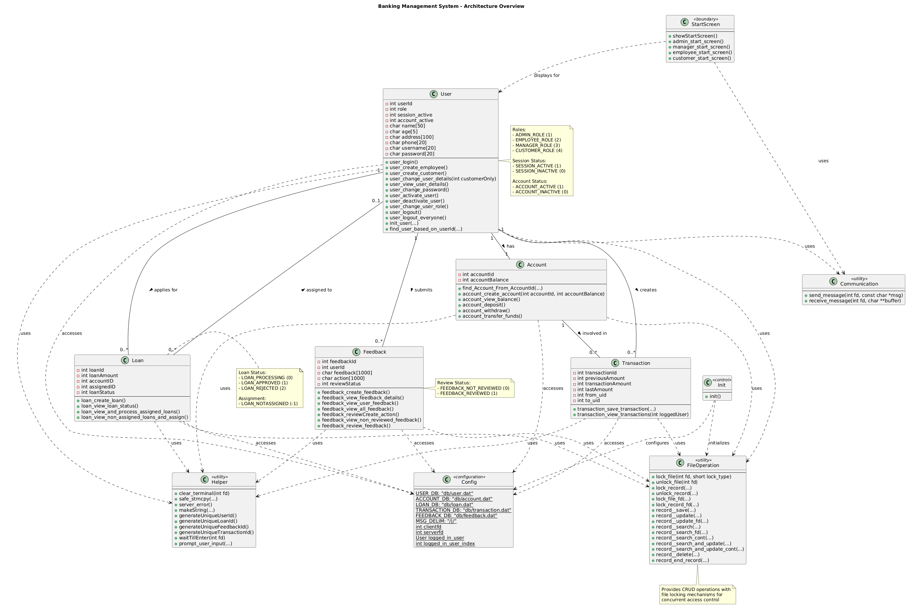

# Banking Management System

Multi-user concurrent banking system with client-server architecture, file-based database, and POSIX file locking.

## Documentation

- [Quick Start Guide](doc/QUICK_START.md)
- [System Flowcharts](doc/flowchart.md)
- [Class Diagram](doc/class_diagram.puml)
- [Workflow](workflow.md)

## Class Diagram



_View source: [class_diagram.puml](doc/class_diagram.puml)_

**Generate PNG:** `plantuml doc/class_diagram.puml` or use VS Code PlantUML extension

## Overview

Client-server banking system supporting multiple concurrent users. Server forks a new process for each client connection.

**Features:**

- TCP/IP socket communication (Port 8080)
- Fork-based concurrency
- Binary file database with fcntl locking
- Role-based access control (4 roles)
- Single session per user enforcement

## User Roles

**Customer (Role 4):** View balance, deposit, withdraw, transfer, apply for loans, submit feedback, view transactions

**Employee (Role 2):** Add customers, modify customer details, process assigned loans, view customer transactions

**Manager (Role 3):** Activate/deactivate accounts, assign loans to employees, review feedback

**Administrator (Role 1):** Add employees/managers, modify any user, change user roles

## Architecture

```
┌──────────┐  ┌──────────┐  ┌──────────┐
│ Client 1 │  │ Client 2 │  │ Client N │
└──────────┘  └──────────┘  └──────────┘
      │            │            │
      └────────────┼────────────┘
                   │ TCP/IP (Port 8080)
                   ▼
           ┌──────────────┐
           │    Server    │
           │  (Fork-based │
           │  Concurrent) │
           └──────────────┘
                   │
                   ▼
           ┌──────────────┐
           │  File-based  │
           │   Database   │
           │  (w/ Locks)  │
           └──────────────┘
```

**Server:** Listens on port 8080, forks process per client, handles authentication

**Client:** TCP connection, interactive terminal, poll() for I/O

**Database:** Binary files (.dat) with fcntl locking - user, account, loan, transaction, feedback

## Prerequisites

- Linux/Unix/macOS
- GCC compiler
- POSIX-compliant system

## Installation

```bash
chmod +x make
./make
mkdir -p code/db
```

## Usage

```bash
# Start server
./make server

# Connect client (new terminal)
./make client
```

## Default Accounts

| Username | Password   | Role          |
| -------- | ---------- | ------------- |
| admin    | admin123   | Administrator |
| manager  | manager123 | Manager       |
| devanshi | 12345      | Employee      |
| diksha   | 12345      | Employee      |
| parag    | 12345      | Employee      |

## Project Structure

```
SS Project/
├── code/
│   ├── db/                      # Database files (created at runtime)
│   │   ├── user.dat
│   │   ├── account.dat
│   │   ├── loan.dat
│   │   ├── transaction.dat
│   │   └── feedback.dat
│   ├── include/                 # Header files
│   │   ├── db/
│   │   │   ├── user.h
│   │   │   ├── account.h
│   │   │   ├── loan.h
│   │   │   ├── transaction.h
│   │   │   └── feedback.h
│   │   ├── communication.h
│   │   ├── config.h
│   │   ├── file_operation.h
│   │   ├── helper.h
│   │   ├── init.h
│   │   └── start_screen.h
│   ├── src/                     # Source files
│   │   ├── db/
│   │   │   ├── user.c
│   │   │   ├── account.c
│   │   │   ├── loan.c
│   │   │   ├── transaction.c
│   │   │   └── feedback.c
│   │   ├── communication.c
│   │   ├── config.c
│   │   ├── file_operation.c
│   │   ├── helper.c
│   │   ├── init.c
│   │   └── start_screen.c
│   └── node/                    # Client-Server nodes
│       ├── server.c
│       └── client.c
├── doc/                         # Documentation
│   ├── flowchart.md            # System flowcharts
│   ├── class_diagram.puml      # UML class diagram
│   └── *.pdf                   # Project reports
├── README.md                    # This file
└── make                         # Build script
```

## Database Structure

#### User Record

```c
typedef struct {
    int userId;              // Unique identifier
    int role;                // 1=Admin, 2=Employee, 3=Manager, 4=Customer
    int session_active;      // 1=Active, 0=Inactive
    int account_active;      // 1=Active, 0=Inactive
    char name[50];
    char age[5];
    char address[100];
    char phone[20];
    char username[20];
    char password[20];
} User;
```

#### Account Record

```c
typedef struct {
    int accountId;           // Same as userId
    int accountBalance;      // Current balance
} Account;
```

#### Loan Record

```c
typedef struct {
    int loanId;              // Unique identifier
    int loanAmount;          // Requested amount
    int accountID;           // Applicant's account
    int assignedID;          // Assigned employee (-1 if unassigned)
    int loanStatus;          // 0=Processing, 1=Approved, 2=Rejected
} Loan;
```

#### Transaction Record

```c
typedef struct {
    int transactionId;       // Unique identifier
    int previousAmount;      // Balance before transaction
    int transactionAmount;   // Transaction amount
    int lastAmount;          // Balance after transaction
    int from_uid;            // Source account (-1 for deposits)
    int to_uid;              // Destination account
} Transaction;
```

#### Feedback Record

```c
typedef struct {
    int feedbackId;          // Unique identifier
    int userId;              // Customer who submitted
    char feedback[1000];     // Feedback text
    char action[1000];       // Manager's response
    int reviewStatus;        // 0=Pending, 1=Reviewed
} Feedback;
```

## Concurrency Control

- F_RDLCK: Shared read locks
- F_WRLCK: Exclusive write locks
- F_SETLKW: Blocking wait for lock
- File-level and record-level locking
- Consistent lock ordering prevents deadlock

## Notes

- Educational project for System Software course, IIIT Bangalore
- Plain text passwords (not for production)
- Port 8080 hardcoded
- Terminal-based interface

---

**Course:** System Software (1st Term), IIIT Bangalore, 2025
